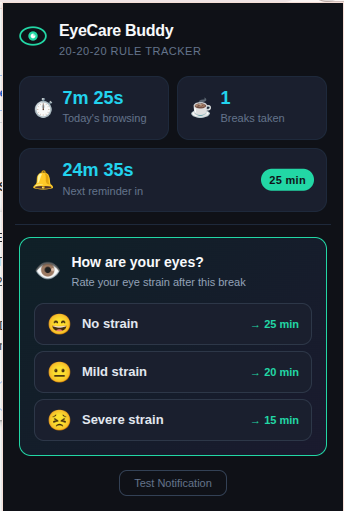
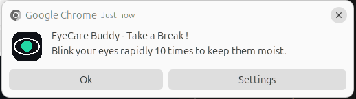
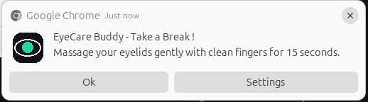
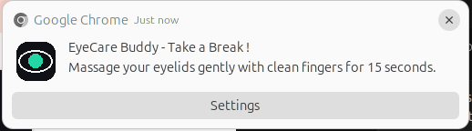

# EyeCare Buddy

A lightweight, adaptive Chrome extension that helps developers reduce eye strain by intelligently reminding them to take breaks and follow the **20-20-20 rule**.

---

## Why I Built This

As an aspiring developer, I spend most of my day and often nights in front of digital screens.

Laptop. Mobile. Documentation. Tutorials. Coding. Repeat.

Over time, I started noticing something worrying.

My eyes were constantly red. The blood vessels in my eyes became visibly swollen, and sometimes my eyes would hurt after hours of continuous screen time. Honestly, there were days when I looked exactly like a drunk😭.

One day, while discussing this with my mom, she gave me the simplest advice:

> **"Just close the laptop and don't use it for so long."**

And she's absolutely right.

But every aspiring developer knows:

> **That's simply not realistic.**

So I started thinking:

*What if I could build something that helps me take care of my eyes without interrupting my work?*

That's how **EyeCare Buddy** was born.

A small but meaningful Chrome extension that quietly runs in the background and encourages healthier screen habits.

---

## Features

### Active Browsing Time Tracking

Tracks how long you actively browse every day and maintains your statistics locally.

---

### Smart 20-20-20 Rule Reminders

Get periodic reminders to follow the famous eye-care rule:

> Every 20 minutes, look at something 20 feet away for 20 seconds.

The goal is simple:

Take tiny breaks before eye strain becomes a problem.

---

### Adaptive Break Intervals

After each break, EyeCare Buddy asks:

**"How are your eyes?"**

😄 **No strain** → Next reminder in **25 minutes**

😐 **Mild strain** → Next reminder in **20 minutes**

😣 **Severe strain** → Next reminder in **15 minutes**

The extension adapts to your feedback and adjusts future reminders accordingly.

---

### Popup Dashboard

Keep track of:

- Today's browsing time
- Number of breaks taken
- Countdown to the next break
- Current reminder interval



---

### Native Chrome Notifications

Gentle reminders that appear right when it's time to take a break.

| Notification 1 | Notification 2 | Notification 3 |
|---|---|---|
|  |  |  |

---

### Privacy First

- No backend
- No accounts
- No analytics
- No data collection

Everything stays locally on your device.

---

## What This Project Means to Me

EyeCare Buddy is not a complex project.

It won't magically cure eye strain.

But it represents something I strongly believe in:

> Technology shouldn't just make us more productive.

> It should also help us stay healthy while pursuing our ambitions.

If this extension reminds someone to blink a little more, take a short break, or protect their eyes while building their dreams—

**then EyeCare Buddy has already achieved its purpose.**

---

## Installation

1. Clone the repository

```bash
git clone <repo-url>
```

2. Open Chrome and navigate to:

```text
chrome://extensions
```

3. Enable **Developer Mode**

4. Click **Load unpacked**

5. Select the project folder

6. Start protecting your eyes 

## Contributions & Enhancements

EyeCare Buddy started as a personal project to solve a real problem I face every day. I would love to see it grow with ideas from the community.

Contributions, enhancements and feature suggestions are always welcome!

Some ideas you can explore:

- Build and maintain a **Firefox extension** version.
- Extend support to other Chromium-based browsers.
- Add richer analytics and eye health insights.
- Improve the UI/UX and accessibility.
- Introduce smarter reminder strategies.
- Experiment with optional AI-powered or computer vision features.

If you have an idea that can make digital wellness better, feel free to:

- Open an issue
- Submit a pull request
- Fork the project and build upon it

Let's build technology that helps people stay healthy while chasing their ambitions.

---

## License

Licensed under the MIT License.
